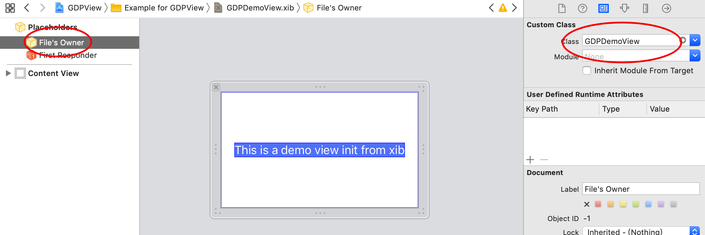
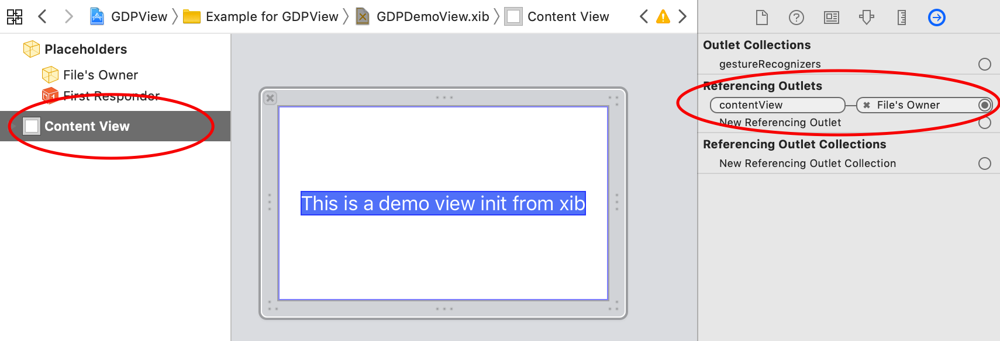
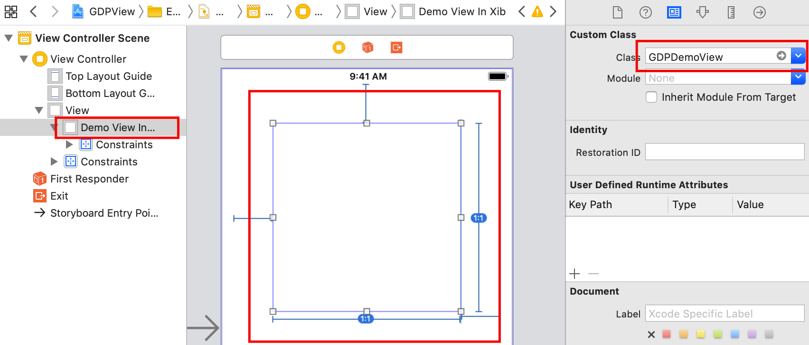

# GDPView

[](https://travis-ci.org/yuyuan/GDPView)
[](https://cocoapods.org/pods/GDPView)
[](https://cocoapods.org/pods/GDPView)
[](https://cocoapods.org/pods/GDPView)

## How to use

To run the example project, clone the repo, and run `pod install` from the Example directory first.
### 1. Create a customized view : GDPDemoView
[GDPDemoView.h](./GDPDemoView.h) 
[GDPDemoView.m](./GDPDemoView.m)
[GDPDemoView.xib](./GDPDemoView.xib)
### 2. Go to `GDPDemoView.xib`, set `File's Owner` as `GDPDemoView` class.  



### 3. Link `File's Owner`'s `contentView` to the view in `GDPDemoView.xib`.


### 4. Do what event you want in the xib file .... (Yeah)

### 5. Use `GDPDemoView` like a `UIView`.
#### (1) By code
```objc
GDPDemoView *demoView = [[GDPDemoView alloc] initWithFrame:CGRectMake(0, 0, 50, 50)];
demoView.detail = @"GDPDemoView, Init by code!";
demoView.contentView.backgroundColor = UIColor.redColor;
[self.view addSubview:demoView];
```
#### (2) In Xib/Storyboard


## Requirements
iOS 8+
Xcode 10+

## Installation

GDPView is available through [CocoaPods](https://cocoapods.org). To install
it, simply add the following line to your Podfile:

```ruby
pod 'GDPView'
```

## Author

yuyuan, yuyuan@gaoding.com

## License

GDPView is available under the MIT license. See the LICENSE file for more info.
